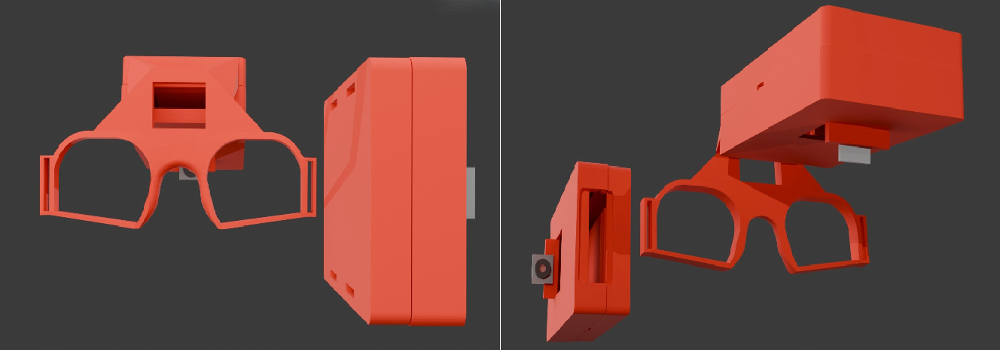

# Eye Tracking Obiquos

A eye-tracking glasses project built on two ESP32 cameras and a Python
postprocessing pipeline. One camera faces the eye, the other faces forward;
both stream MJPEG over Wi-Fi to a PC, which estimates where the eye is
looking and maps that gaze onto the forward-facing view in real time.

## Overview

Commercial eye trackers are expensive and closed. This project explores an
alternative: two ESP32 camera modules mounted on a
glasses frame, streaming to a PC over their own private Wi-Fi network, with
all the gaze estimation, calibration, and recording done in Python on the
PC side — no cloud, no proprietary hardware.



### Pipeline

```
┌──────────────┐      ┌──────────────┐       ┌──────────────────────┐
│  Eye camera  │      │   Forward    │       │   PC postprocessing  │
│  (ESP32,     │─────▶│   camera     │─────▶│                      │
│   STA unit)  │ Wi-Fi│ (ESP32-S3,   │ Wi-Fi │ • Pupil detection    │
│              │      │  AP unit)    │       │ • Calibration        │
└──────────────┘      └──────────────┘       │ • Gaze → forward     │
                                             │   angle mapping      │
                                             │ • Web viewer + rec.  │
                                             └──────────────────────┘
```

The forward camera's ESP32 also runs as the Wi-Fi access point the eye
camera joins, so the pair works as a self-contained network with no router
required — just a PC joining that same hotspot.

## Key Features

- **Dual MJPEG streaming** from two ESP32 boards over a private Wi-Fi hotspot
- **Pupil-based gaze estimation** mapped from the eye camera's angle to a
  point in the forward camera's view
- **Multi-point calibration**, with separate saved profiles for `child` and
  `adult` users (different assumed geometry/FOV defaults)
- **Web-based dual-stream viewer** (Flask) with live gaze overlay, session
  recording, and plate/target tracking for validating gaze accuracy
- **Post-session validation** — compare predicted gaze against a known
  target to quantify accuracy after the fact

## Repository Layout

```
firmware/
├── esp32_eye_camera/        ESP-IDF firmware for the eye-facing camera (STA)
└── esp32s3_forward_camera/  ESP-IDF firmware for the forward-facing camera (AP)

postprocessing/
├── dual_stream_viewer.py    Side-by-side viewer for both MJPEG streams
├── dual_stream_web.py       Web-based viewer/recorder (Flask) — main entry point
├── eye_forward_alignment.py Gaze estimation + calibration + overlay
├── plate_tracker.py         License-plate/target tracking
├── mjpeg_stream.py          Shared MJPEG stream reader
└── validate_session.py      Session/recording validation

run.bat                      One-command setup + launch (Windows)
```

See [`firmware/esp32_eye_camera/README.md`](firmware/esp32_eye_camera/README.md) and
[`firmware/esp32s3_forward_camera/README.md`](firmware/esp32s3_forward_camera/README.md)
for building and flashing each board, and
[`postprocessing/README.md`](postprocessing/README.md) for the PC-side pipeline.

## Getting Started

See [SETUP.md](SETUP.md) for the full environment setup, flashing, and run
instructions. If the boards are already flashed and on their Wi-Fi network,
Windows users can just run `run.bat`, which sets up the Python environment
and launches the web viewer in one step.

Quick version, from scratch:

```bash
# Python side
setup_venv.bat                     # or: python -m venv venv && pip install -r requirements.txt
cp .env.example .env               # then fill in your stream URLs/profile/port

# Firmware side (per board, from its own firmware/ subfolder)
cp sdkconfig.local.example sdkconfig.local   # then fill in your Wi-Fi SSID/password
idf.py build flash monitor
```

**Before flashing real hardware**, change the default Wi-Fi credentials —
`main/Kconfig.projbuild` in each firmware target ships with a placeholder
password (`changeme123`) that must not be left in place on deployed devices.
Set your own via `sdkconfig.local` (gitignored, merged automatically) rather
than editing the checked-in `sdkconfig.defaults`.

## Known Limitations

- **Stream IPs assume a fresh, dedicated network.** The forward camera (AP)
  is always `192.168.4.1`; the eye camera (STA) gets `192.168.4.2` as the
  first and only DHCP client. This is reliable in practice but not
  guaranteed — both firmware targets also advertise mDNS hostnames
  (`forward-cam.local` / `eye-cam.local`) as a fallback, though plain
  Windows doesn't always resolve `.local` names without extra software.
- **One Wi-Fi radio at a time.** Joining the glasses' hotspot means the PC
  loses its normal internet connection for the duration of the session.
- **Calibration is per-profile, not per-user.** The `child`/`adult` profiles
  set default geometry assumptions; accuracy still depends on running the
  multi-point calibration for the actual wearer.

## Dependencies

See [`requirements.txt`](requirements.txt) for the full Python dependency list.


